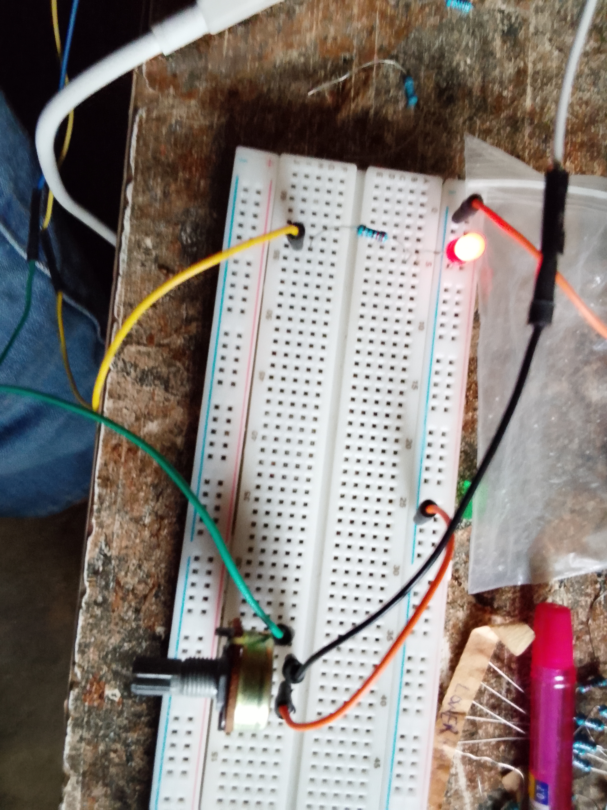

# LED_Brightness_Controlled_Using_A_Potentiometer_using_stm32f401ccu6

## Overview
This project demonstrates how to control the brightness of an LED using a potentiometer and the STM32F401CCU6. The potentiometer provides an analog voltage that is read by the ADC, and the measured value is used to adjust the PWM duty cycle, allowing smooth and continuous LED brightness control.

## Project Code
[Click here to access the project code](code)

## Project Image

## Final Outcome
- LED brightness changes smoothly as the potentiometer is rotated.
- Analog input is converted into a PWM duty cycle in real time.
- Brightness responds instantly to changes in the potentiometer position.

## Features
- Analog-to-Digital Conversion (ADC)
- Pulse Width Modulation (PWM)
- Real-time brightness adjustment
- Timer-based PWM generation
- Register-level (Bare-Metal) STM32 programming

## Project Demo video
[Click here to check out the Demostration Video](https://youtube.com/shorts/XR25fPwKZ8I?feature=share)

## Hardware Used
- STM32F401CCU6 Black Pill
- ST-Link V2 Programmer
- LED
- 220Ω Resistor
- 10kΩ Potentiometer
- Breadboard
- Jumper Wires

## Learning Objectives
- Understand how ADC converts analog signals into digital values.
- Learn how PWM controls LED brightness.
- Interface a potentiometer with the STM32 ADC.
- Control PWM duty cycle using analog sensor input.
- Gain experience configuring STM32 peripherals at the register level.

## Project Status
✅ Completed
